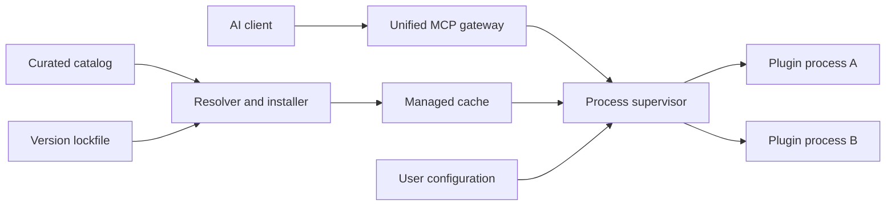

# Architecture

AfterDark MCP Builder is a modular monolith with ports and adapters around
third-party package managers and MCP transports. Third-party plugins always run
outside the gateway process.

For regulated deployments this local architecture is the endpoint data plane.
The connected importer, review workflow, signed OCI registry, and TUF metadata
form a separate control plane. See ADR 0001 and the threat model.



## Responsibilities

### Catalog

Describes projects AfterDark has evaluated. Catalog entries declare provenance,
installation strategy, runtime, configuration variables, permissions, health
checks, documentation, and lifecycle status. Catalog data contains no secrets.

### Resolver and installer

Chooses a concrete version, verifies prerequisites, asks for required
permissions, installs into an isolated cache location, and records the resolved
artifact and integrity information. Installers are typed adapters for npm,
Python, Git releases, and containers; catalog entries do not contain arbitrary
installation shell scripts.

### Supervisor

Starts enabled plugins, captures logs, monitors health, applies restart policy,
and shuts processes down cleanly. The initial implementation runs in the
foreground with `mcp-builder serve`. Platform service installation is a later
adapter around the same supervisor.

### Gateway

Acts as an MCP server toward clients and an MCP client toward plugins. It
discovers plugin capabilities at runtime, exposes them under stable plugin
namespaces, and routes requests to the owning process. A failed plugin removes
only its own capabilities and does not crash the gateway.

## State boundaries

| State | Location | Version controlled |
|---|---|---|
| Curated catalog | `catalog/` | Yes |
| Project configuration | project config | Yes, without secrets |
| Resolved plugin versions | lockfile | Yes |
| Downloaded artifacts | managed cache | No |
| Logs and process IDs | runtime state | No |
| Credentials | environment or OS secret store | No |

## Plugin lifecycle

```text
discover -> approve permissions -> resolve -> install -> configure
         -> initialize -> healthy -> expose capabilities -> stop/update/remove
```

Every transition must be observable and safe to retry. Installation into a
temporary location is promoted atomically only after verification succeeds.

## Implemented baseline

The first supported adapter installs pinned npm packages with lifecycle scripts
disabled, verifies the package-lock integrity value, and atomically promotes the
temporary installation into the cache. Context7 exercises this path.

The gateway currently supports stdio and loopback-only stateless Streamable
HTTP. Each HTTP request receives the MCP SDK's required fresh server/transport
pair while sharing the supervised plugin clients and routing table. Tool names
use the stable `<plugin>__<tool>` namespace.
