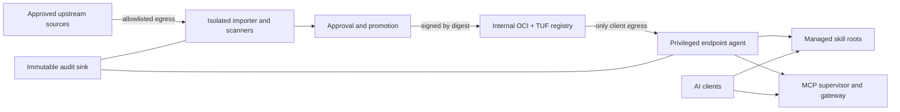

# Threat model

## Protected assets

- Agent instruction context and tool surface
- User and workload credentials
- Source code, customer data, and regulated records
- Managed client configuration
- Artifact signing keys and approval identities
- Registry metadata, audit logs, and revocation state

## Trust zones

## Primary threats and required controls

| Threat | Required controls |
|---|---|
| Compromised upstream repository | Immutable revision, independent scan, approval, signed internal artifact |
| Tag or dependency substitution | Exact resolution, vendored dependencies, digest lock, SBOM |
| Malicious skill prompt injection | Markdown/reference scan, manual review, approved digest only |
| Skill code execution or exfiltration | Static analysis, sandbox tests, declared permissions, endpoint egress controls |
| Unauthorized local skill | Managed-root ACL, receipt verification, reconciliation, quarantine |
| Registry compromise | Client-side signature and TUF verification; registry never establishes trust alone |
| Signing-key compromise | KMS/HSM, threshold roles, key rotation, revocation, short-lived promotion metadata |
| Rollback or freeze attack | TUF snapshot/timestamp versions and expiry |
| MCP privilege expansion | Per-plugin identity, declared capability policy, isolated process/container, minimal env |
| Catalog/policy tampering | Signed policy bundle, digest pinning, immutable audit trail |
| Operator bypass | Separation of duties and logged, expiring break-glass approval |

## Fail-closed invariants

- No artifact digest, no install.
- No valid signature from an allowed identity, no install or execution.
- No current TUF metadata, no new install or update.
- No explicit artifact approval, no install.
- No declared permission approval, no execution.
- No valid local receipt matching installed content, no exposure to clients.
- Scanner failure or unavailable policy service is a denial, never an implicit pass.
